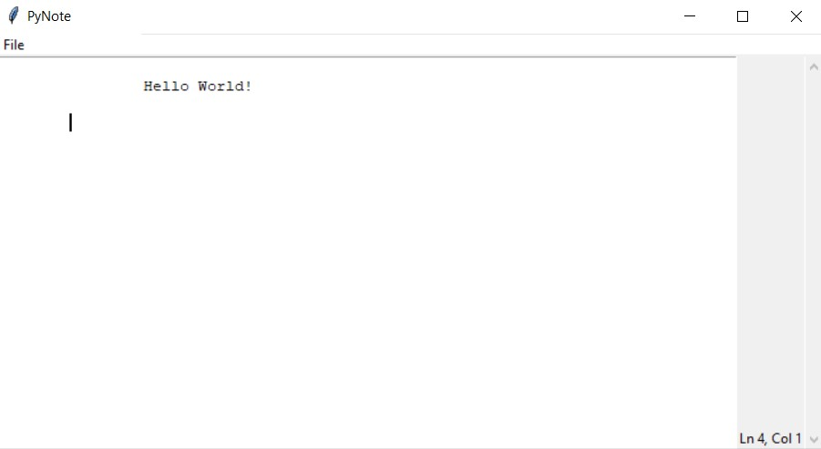
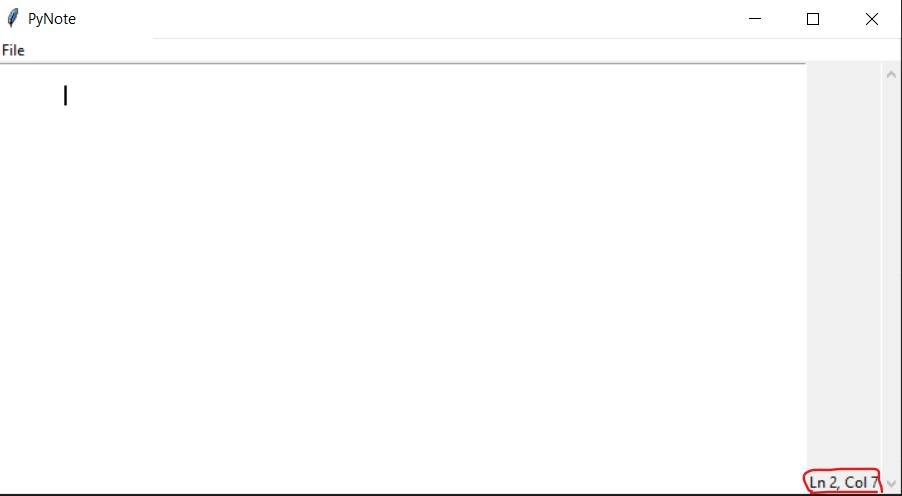
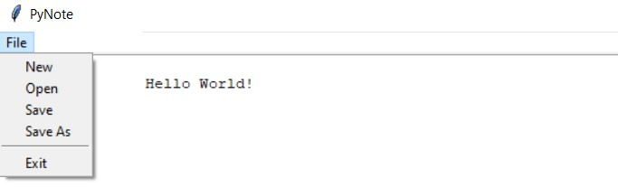
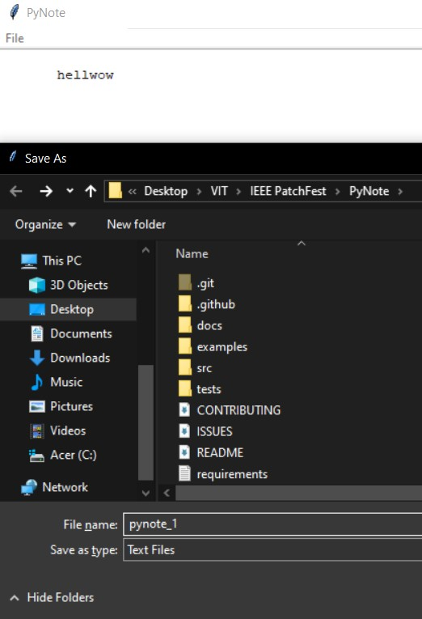
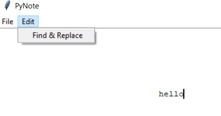
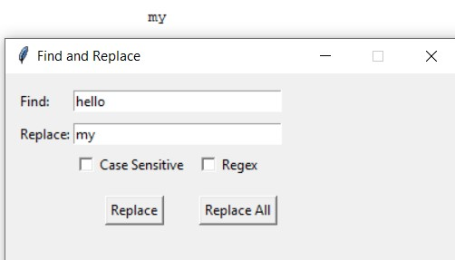

# PyNote — A Beginner-Friendly Desktop Text Editor


---

# 📝 PyNote
PyNote is a lightweight, cross-platform desktop text editor built using Python + Tkinter.
It is designed specifically for college students and beginner open-source contributors, offering:
- Immediate visual wins (UI, theming, small features)
- Medium to advanced challenges (file I/O, UI architecture, syntax highlighting)
- A real, usable application contributors can proudly showcase

---
# ✨ Why PyNote?
Most beginner editors are either:
- Too trivial (toy projects), or
- Too complex (VS Code–level architecture)
PyNote sits in the sweet spot:
- Easy to understand
- Cleanly structured
- Incrementally extensible

---

# 📸 Screenshots

### Main Editor Window

 <br>
*A clean and minimal editor interface with status bar and scrollbar.* <br>

### Cursor Tracking & Status Bar
<br>
*Live line and column tracking for precise editing.* <br>

### File Menu & Shortcuts

<br>
*Built-in file operations with familiar keyboard shortcuts.* <br>

### Save Dialog
<br>
*Native OS file dialogs for saving and opening files.* <br>

### Find and Replace
<br>
*Edit Menu.* <br>

<br>
*Dialog Box.* <br>

<br>
*Replaced the word.* <br>

---
# 🎯 Project Goals

🟢 Give new contributors immediate, visible wins (UI, theming, docs)

🟡 Provide medium & hard tasks that teach practical skills:

- File I/O
- UI design patterns
- Tokenizers and parsers

🔵 Build a real editor, not a throwaway demo

---

# ✨ Core Features (MVP)

- ✅ Open / Save / Save As
- ✅ Undo / Redo
- ✅ Line numbers
- ✅ Status bar (line & column)
- ✅ Keyboard shortcuts:
  - `Ctrl + S` → Save
  - `Ctrl + O` → Open
  - `Ctrl + Z` → Undo
  - `Ctrl + Y` → Redo
- ✅ Light / Dark theme toggle
- ✅ Configurable autosave

---

# 🚀 Nice-to-Have Features (Stretch Goals)
- Tabbed editing (multiple files)
- Find & Replace dialog
- Syntax highlighting (Python / JS / HTML)
- Persistent settings (JSON)
- Recent files list
- Markdown preview (split view)
- Plugin system (hook-based)
- Spell checking (pyspellchecker)

---
## 📋 Quickstart

### Prerequisites

* Python 3.10+ (3.11 recommended)

### Installation

1. Clone the repository:
```bash
git clone https://github.com/YOUR_ORG/PyNote.git
cd PyNote
```

2. Create virtual environment and install dependencies:
```bash
python -m venv .venv

# On Windows:
.venv\Scripts\activate

# On macOS/Linux:
source .venv/bin/activate

pip install -r requirements.txt
```

3. Run the application:
```bash
python -m src.pynote.main
```

## 📁 Project Structure

```
PyNote/
├── .github/
│   ├── ISSUE_TEMPLATE/
│   │   ├── bug_report.md
│   │   └── feature_request.md
│   └── workflows/
│       └── python-app.yml
├── docs/
│   ├── ROADMAP.md
│   └── DESIGN.md
├── src/
│   └── pynote/
│       ├── __init__.py
│       ├── main.py          # starter app
│       ├── editor.py        # Text widget wrapper
│       ├── ui.py            # UI components (menus, dialogs)
│       ├── themes.py        # theme definitions
│       └── utils.py         # helper functions
├── tests/
│   └── test_utils.py
├── examples/
│   └── example.md
├── CONTRIBUTING.md
├── README.md
├── LICENSE
└── requirements.txt
```
---
## 🧑‍💻 Usage Examples

### Create a New File
1. Launch **PyNote**
2. Click **File → New**
3. Start typing immediately in the editor area

Use this to quickly jot down notes or start drafting a new file.

---

### Open an Existing File
1. Click **File → Open**
2. Select a file from your system

Supported formats:
- `.txt`
- `.md`
- `.py`
- Any plain-text file

The file contents will load directly into the editor.

---

### Save Your Work
- Press **Ctrl + S** to save the current file
- If the file is new, PyNote will prompt for a save location
- Use **File → Save As** to save under a different name or format

---

### Track Cursor Position
The status b
---
## 🤝 Contributing

We welcome contributions! Please see [CONTRIBUTING.md](CONTRIBUTING.md) for guidelines.

* Look for issues labeled `good first issue` to get started
* Check the [ROADMAP.md](docs/ROADMAP.md) for project milestones
* All PRs should reference an issue

## 🗺️ Roadmap

See [docs/ROADMAP.md](docs/ROADMAP.md) for detailed milestones:

* `v0.1 - MVP` (Open/Save, menu, status bar, shortcuts)
* `v0.2 - UX` (themes, line numbers, autosave)
* `v0.3 - Power features` (tabs, find/replace, syntax highlighting)
* `v1.0 - Release` (stable, docs, tests)

## 🐛 Reporting Issues

Found a bug or have a feature request? Please use our [issue templates](.github/ISSUE_TEMPLATE/)!

## 📄 License

This project is licensed under the MIT License - see the [LICENSE](LICENSE) file for details.

---

**Happy Coding! 🎉**

